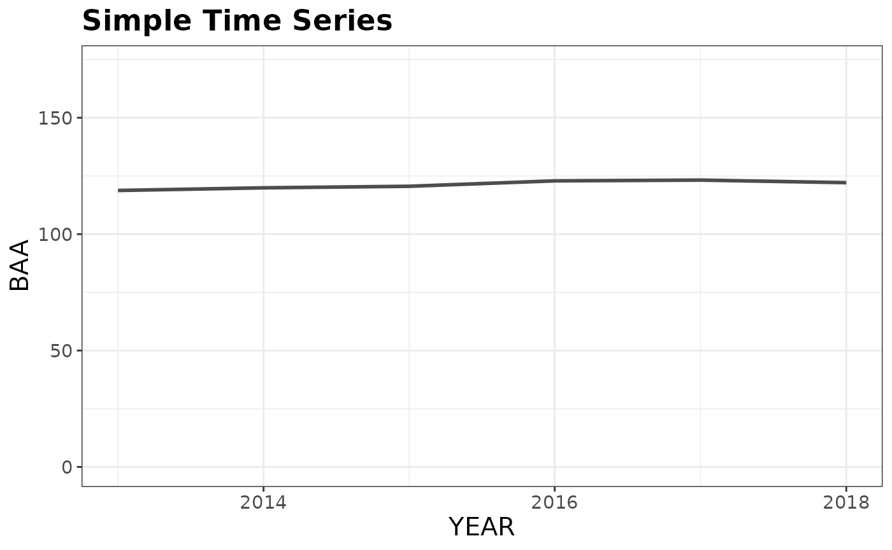
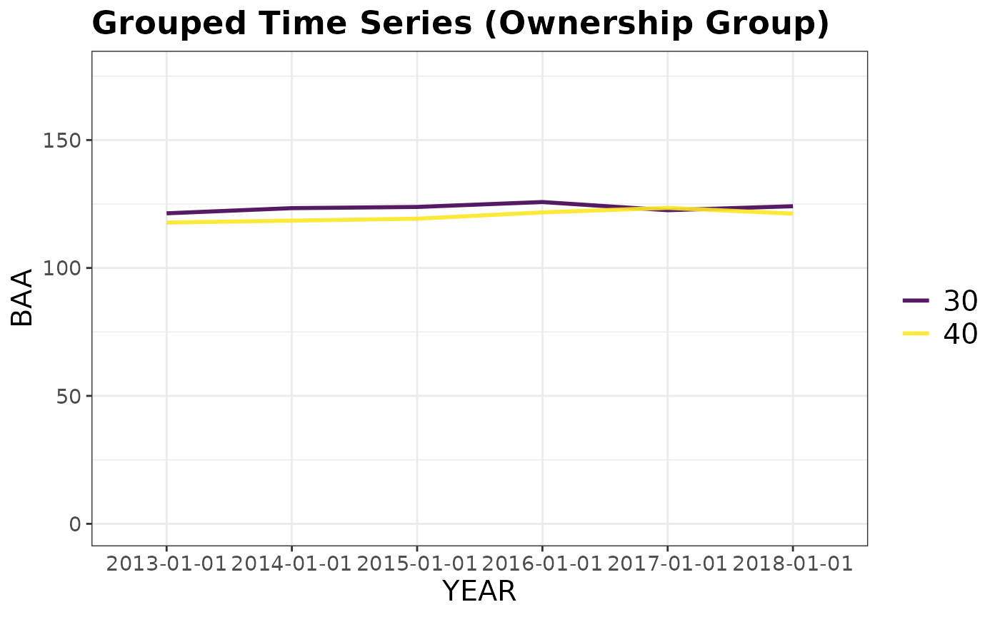
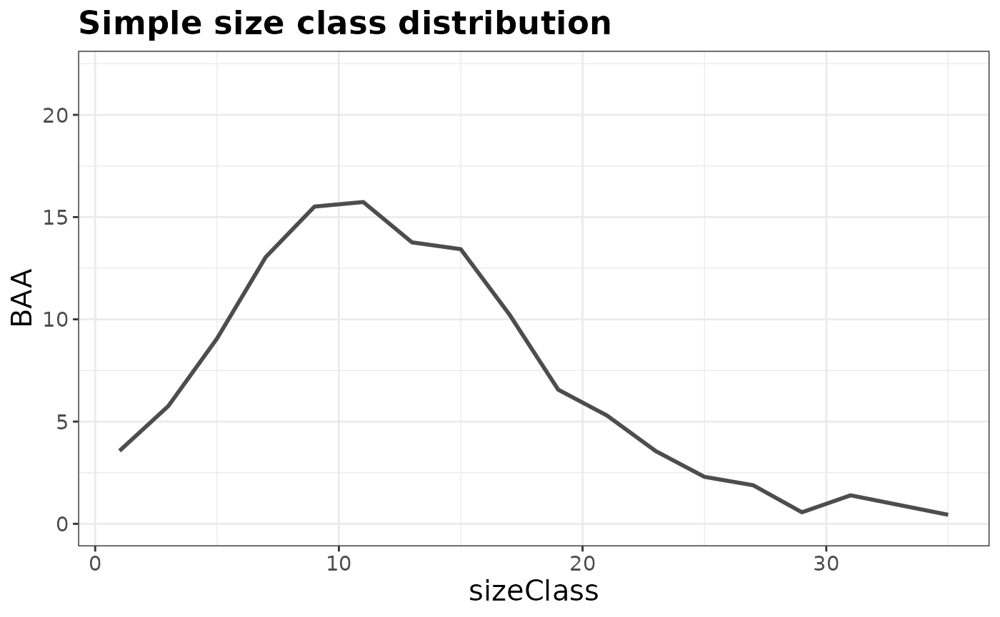
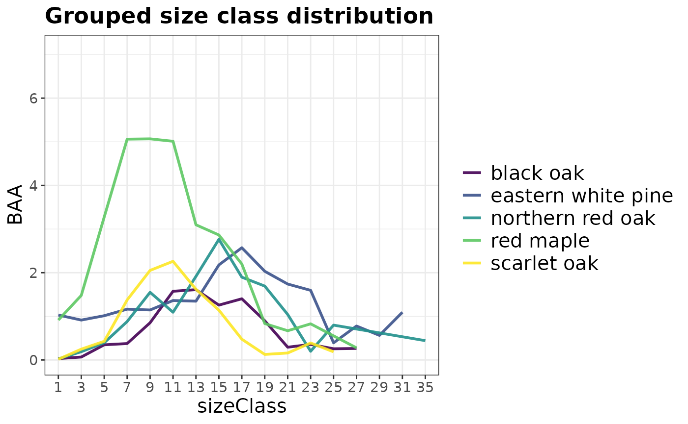

# Estimating Forest Attributes

Now that you have loaded your FIA data into R, it’s time to put it to
work. Let’s explore the basic functionality of `rFIA` with
[`tpa()`](../reference/tpa.md), a function to compute tree abundance
estimates (TPA, BAA, & relative abundance (%)) from FIA data, and
`fiaRI`, a subset of the FIA Database for Rhode Island including all
inventories from 2013-2018.

The two example datasets used below are included with `rFIA`. You can
copy and paste the code below directly into R to follow along without
having to download any data!

## Spatial and temporal queries

Are you only interested in producing estimates for a specific inventory
year or within a portion of your state?
[`clipFIA()`](../reference/clipFIA.md) allows you to easily query
(subset) your `FIA.Database` object so you only use the data you need.
This will conserve RAM on your machine and speed processing time.

##### Load some data

``` r
# Load rFIA package
library(rFIA)

# Load some data
data('fiaRI')
data('countiesRI')
```

##### Most recent subsets

To subset only the data needed to produce estimates for the most recent
inventory year (2017 in our case), users can simply pass their
`FIA.Database` object to [`clipFIA()`](../reference/clipFIA.md), or more
explicitly specify `mostRecent = TRUE` in the call:

``` r
# Most Recent Subset (2017)
riMR <- clipFIA(fiaRI) 

# More explicity (identical to above)
riMR <- clipFIA(fiaRI, mostRecent = TRUE)
```

##### Spatial subsets

To subset the data required to produce estimates within a user-defined
areal region (should be contained within the spatial extent of the
`FIA.Database object`), simply pass a spatial polygon object (from `sp`
or `sf` packages) to the `mask` argument of `clipFIA`. While `sp`
polygon objects continue to be supported, we highly encourage the use of
`sf` objects given that `sp` is slowly being depracated in favor of
`sf`. In our example below, the spatial subset does little to reduce the
size of our `FIA.Database` object, although the effect is likely to be
much more substantial if applied to a larger state or region.

``` r
# Select Kent County RI
kc <- countiesRI[2,] # sf Multipolygon object

# Subset the data
riKC <- clipFIA(fiaRI, mask = kc, mostRecent = FALSE)

# Most recent subset, within Kent County
riKC <- clipFIA(fiaRI, mask = kc)
```

## Basic population estimates

To produce tree abundance estimates and associated sampling errors for
the state of Rhode Island, simply hand your `FIA.Database` object to the
`db` argument of [`tpa()`](../reference/tpa.md):

``` r
# TPA & BAA for the most recent inventory year
tpaRI_MR <- tpa(riMR)

# All inventory years available (i.e., returns a time series)
tpaRI <- tpa(fiaRI)
```

If you would like to return estimates of population totals (e.g., total
trees) along with ratio estimates (e.g., mean trees/acre), specify
`totals = TRUE` in the call to [`tpa()`](../reference/tpa.md). All
estimation functions in `rFIA` by default return the sampling error
(i.e., standard deviation / mean \* 100) as a measure of uncertainty in
the population estimates. Alternatively, you can specify
`variance = TRUE` to return the variance instead of the sampling error.

## Basic plot-level estimates

To return the same estimates at the plot level (e.g., mean TPA & BAA for
each plot), specify `byPlot = TRUE`. For tree-level estimates, specify
the argument `treeList = TRUE`, which will return a tree list. The tree
list can easily be used with the
[`customPSE()`](../reference/customPSE.md) function to generate
population estimates for custom variables.

``` r
# Plot-level
tpaRI_plot <- tpa(riMR, byPlot = TRUE)

# Tree list
tpaRI_tree <- tpa(riMR, treeList = TRUE)
```

## Grouping by species and size class

What if I want to group estimates by species? How about by size class?
Easy! Just specify `bySpecies` and/ or `bySizeClass` as `TRUE` in the
call to `tpa`. By default, estimates are returned within 2 inch size
classes, but you can make your own size classes using
[`makeClasses()`](../reference/makeClasses.md)!

``` r
# Group estimates by species
tpaRI_species <- tpa(riMR, bySpecies = TRUE)

# Group estimates by size class
tpaRI_sizeClass <- tpa(riMR, bySizeClass = TRUE)

# Group by species and size class
tpaRI_spsc <- tpa(riMR, bySpecies = TRUE, bySizeClass = TRUE)
```

## Grouping by other variables

To group estimates by a variable defined in the FIA Database (other than
species or size class), pass the variable name to the `grpBy` argument
of [`tpa()`](../reference/tpa.md). You can find definitions of all
variables in the FIA Database in the the [FIA User
Guide](https://research.fs.usda.gov/understory/forest-inventory-and-analysis-database-user-guide-nfi).
Variables of interest will most likely be contained in the condition
(COND), plot (PLOT), or tree (TREE) tables.

``` r
# grpBy specifies what to group estimates by (just like species and size class above)
# NOTICE the variable names passed to grpBy are NOT quoted

# Ownership Group
tpaRI_own <- tpa(riMR, grpBy = OWNGRPCD)

# Ownership Group (for all available inventories)
tpaRI_ownAll <- tpa(fiaRI, grpBy = OWNGRPCD)

# Site Productivity Class
tpaRI_spc <- tpa(riMR, grpBy = SITECLCD)

# Forest Type
tpaRI_ft <- tpa(riMR, grpBy = FORTYPCD)

# Combining multiple grouping variables: Site Productivity within Forest Types
tpaRI_ftspc <- tpa(riMR, grpBy = c(FORTYPCD, SITECLCD))
```

Variable names passed to `grpBy` should NOT be quoted. Multiple grouping
variables should be combined with
[`c()`](https://rdrr.io/r/base/c.html), and grouping will occur
hierarchically. For example, to produce separate estimates for each
ownership group within ecoregion subsections, specify
`c(ECOSUBCD, OWNGRPCD)`.

## Unique areas or trees of interest

Do you want estimates for a specific type of tree (e.g., greater than
12-inches DBH and in a canopy dominant or subdominant position) in a
specific area (e.g., growing on mesic sites)? Each of these
specifications are described in the FIA Database, and all `rFIA`
estimator functions can leverage these data to easily implement complex
queries!

For conditions related to trees of interest (e.g., diameter, height,
crown class, etc.) pass a logical statement to `treeDomain`. For
conditions related to area (e.g., ecoregions, counties, forest types,
etc.), pass a logical statement to `areaDomain`. *These statements
should NOT be quoted.*

``` r
# Estimate abundance of trees greater than 12-inches DBH in a dominant 
# or subdominant canopy position growing on mesic sites
tpaRI_domain <- tpa(riMR, 
                    treeDomain = DIA > 12 & CCLCD %in% c(1,2),
                    areaDomain = PHYSCLCD %in% 20:29)
```

In the code above, DIA describes the DBH of stems, CCLCD their canopy
position, and PHYSCLCD the physiographic class upon which the class
occurs. You can find definitions of all variables in the [FIA User
Guide](https://research.fs.usda.gov/understory/forest-inventory-and-analysis-database-user-guide-nfi).
Variables of interest will most likely be contained in the condition
(COND), plot (PLOT), or tree (TREE) tables.

## Visualization

Now that we have produced some estimates, we should translate them into
plots so we can easily see the status and trends in our selected forest
attributes. Using [`plotFIA()`](../reference/plotFIA.md), we can easily
produce (1) simple or grouped time series plots, (2) simple or grouped
plots with a user defined x-axis (e.g., size class), and (3) spatial
chloropleth maps (see [Incorporating Spatial
Data](https://doserlab.com/files/rfia/articles/spatial)).

##### Time Series Plots

By default, [`plotFIA()`](../reference/plotFIA.md) will produce time
series plots if you produced estimates for more than one reporting year
and do not specify a non-temporal x-axis. To produce a grouped time
series, simply hand the grouping variables to the `grp` argument of
[`plotFIA()`](../reference/plotFIA.md) (should correspond with the
`grpBy` argument of estimating function).

``` r
# Using our estimates from above (all inventory years in RI)
plotFIA(tpaRI, y = BAA, plot.title = 'Simple Time Series')
```



``` r
# Grouped time series by ownership class
plotFIA(tpaRI_ownAll, y = BAA, grp = OWNGRPCD, 
        plot.title = 'Grouped Time Series (Ownership Group)')
```



##### Non-temporal plots

To define your own x-axis, simply specify the variable you would like to
use in the `x` argument of the [`plotFIA()`](../reference/plotFIA.md)
call. This is great for plotting things like size-class distributions.
Since these plots do not have time as an axis, they are best suited for
plotting estimates from a single point in time (e.g., a most recent
subset).

``` r
# BAA by size class for most recent inventory
plotFIA(tpaRI_sizeClass, y = BAA, x = sizeClass, plot.title = 'Simple size class distribution')
```



``` r
# Size class distribution for the five most common species in the 
# most recent inventory of RI 
plotFIA(tpaRI_spsc, y = BAA, grp = COMMON_NAME, x = sizeClass, 
        n.max = 5, plot.title = 'Grouped size class distribution')
```



You can specify `n.max` to any grouped call to `plotFIA` to only display
the top or bottom `n` groups in your plot. In the call above we
specified `n.max = 5`, resulting in the species with the highest average
basal area per acre values being plotted. To only plot the bottom five,
specify `n.max = -5`.

## Variance vs Sampling Error

FIA’s flagship online estimation tool,
[EVALIDator](https://apps.fs.usda.gov/fiadb-api/evalidator), reports
estimates of uncertainty as “% sampling error” (SE). While the
definition is a bit elusive, this measure is simply the % coefficient of
variation, or the sample standard deviation divided by the sample mean
multiplied by 100. FIA opts to report SE as opposed to sample variance
because SE provides an easy, “standardized” way to compare uncertainty
across estimates with very different absolute values (i.e., how large is
the “spread” relative to the mean?). However, SE has its downsides.
First, confidence intervals cannot be derived directly from SE. Second,
the “standardized” nature of the SE breaks down as the mean approaches
zero (SE approaches infinity in this case), making it particularly
uninformative for change estimates that tend near zero.

In `rFIA` we allow users to return estimates of uncertainty in terms of
SE *or* sample variance using the `variance` argument (where
`variance=TRUE` returns sample variance). Along with the sample size,
sample variance can be used to produce proper confidence intervals for
totals and ratios:

``` r
# TPA with % sampling error (SE)
tpaSE <- tpa(riMR, variance = FALSE)
tpaSE
```

    ## # A tibble: 1 × 8
    ##    YEAR   TPA   BAA TPA_SE BAA_SE nPlots_TREE nPlots_AREA     N
    ##   <dbl> <dbl> <dbl>  <dbl>  <dbl>       <int>       <int> <int>
    ## 1  2018  427.  122.   6.63   3.06         126         127   199

``` r
# TPA with % sampling error (SE)
tpaVAR <- tpa(riMR, variance = TRUE)
tpaVAR
```

    ## # A tibble: 1 × 8
    ##    YEAR   TPA   BAA TPA_VAR BAA_VAR nPlots_TREE nPlots_AREA     N
    ##   <dbl> <dbl> <dbl>   <dbl>   <dbl>       <int>       <int> <int>
    ## 1  2018  427.  122.    801.    13.9         126         127   199

``` r
# Estimate 95% confidence interval around 2018 TPA
halfInt <- qt(0.975, tpaVAR$N - 1) * sqrt(tpaVAR$TPA_VAR)

# Lower
tpaVAR$TPA - halfInt
```

    ## [1] 370.9086

``` r
# Upper
tpaVAR$TPA + halfInt
```

    ## [1] 482.5153

## Other rFIA functions

Fortunately, all of the `rFIA` estimator functions are structured in the
same way as [`tpa()`](../reference/tpa.md). Therefore you can use
essentially the same argument calls we’ve used above to produce
estimates of other types of forest attributes! Notably, for some `rFIA`
functions like [`dwm()`](../reference/dwm.md) (estimates down woody
material volume, biomass, and carbon) it does not make sense to include
arguments like `treeDomain` or `bySpecies`, and hence these arguments
are not available. For other functions, like
[`area()`](../reference/area.md) or
[`biomass()`](../reference/biomass.md), additional grouping options
exist. Check out the help pages for these functions for more details.
