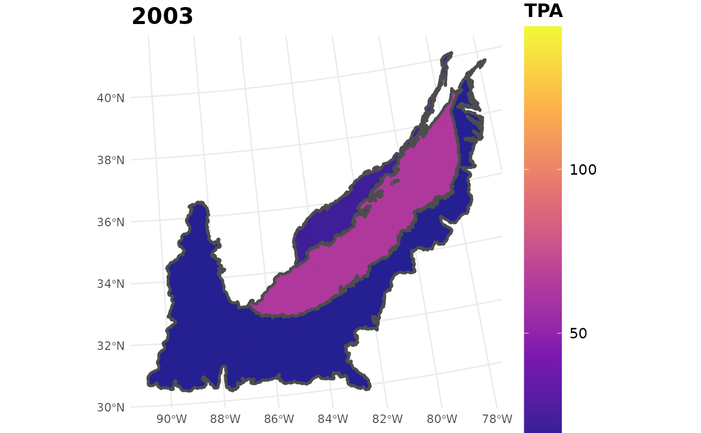
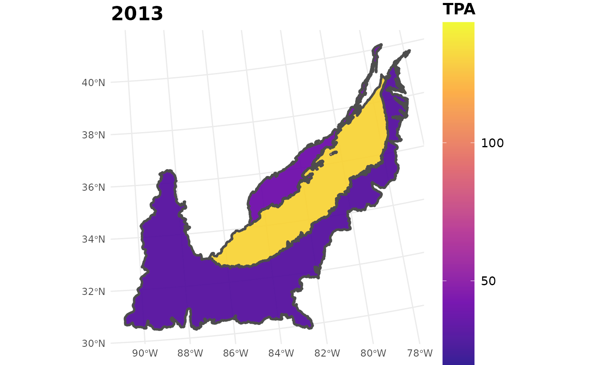
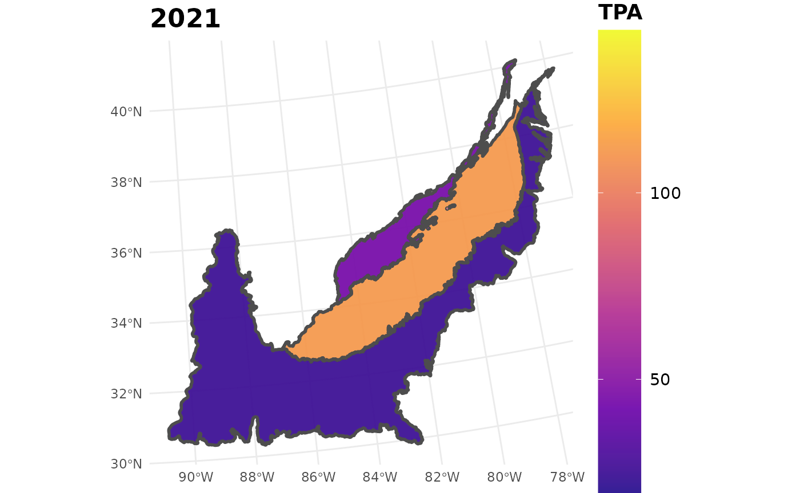
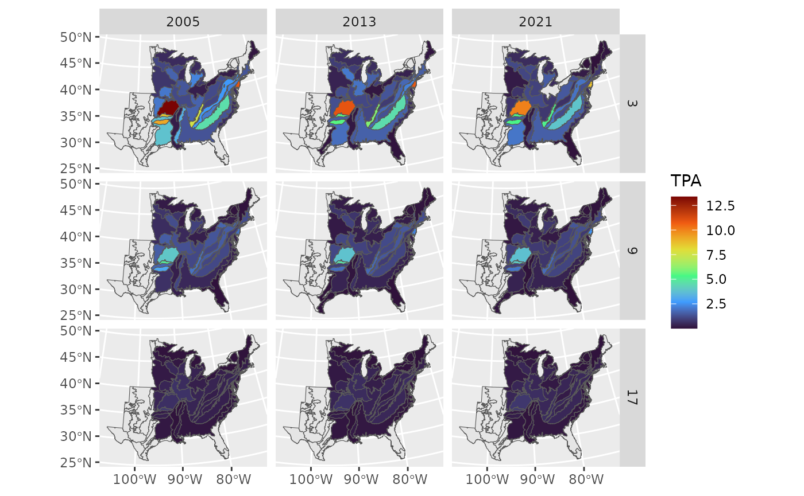
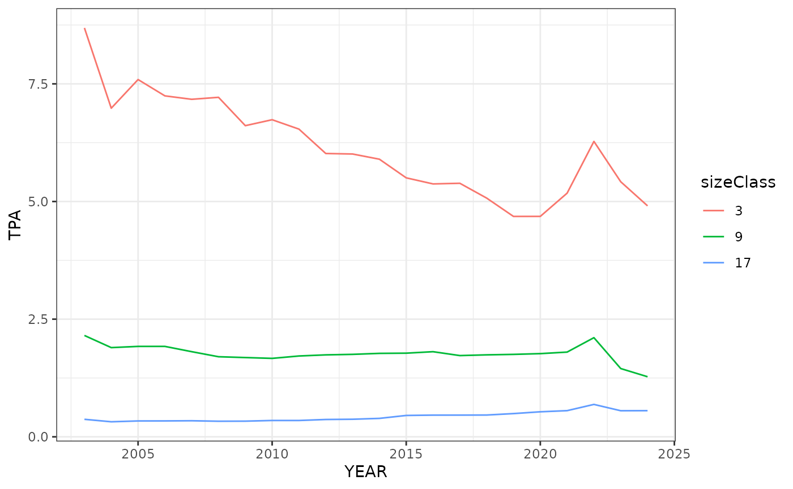
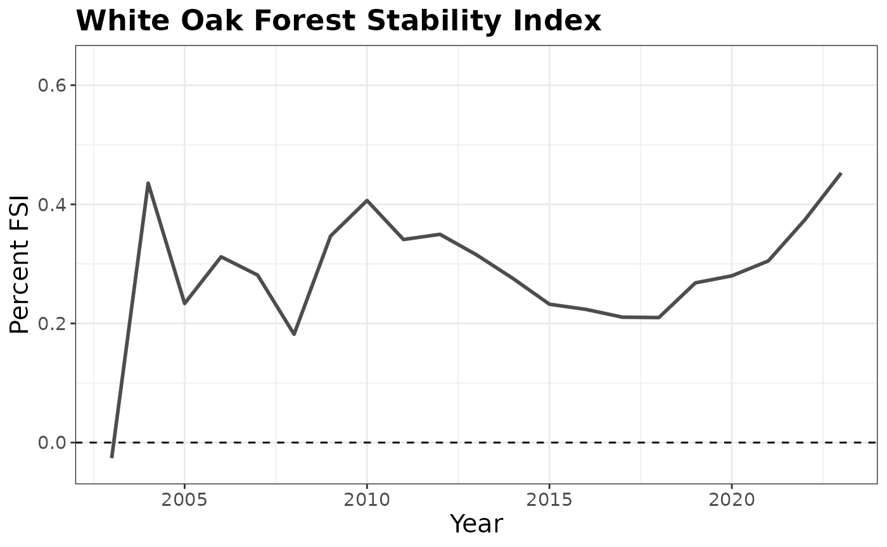

# Estimating change in white oak populations across its range in the eastern US

## Introduction

Oak regeneration and the effects of mesophication have become
substantial concerns in the United States given the importance of oaks
for numerous wildlife species and their importance in local and regional
timber economies. There has been an observed “oak bottleneck” where the
majority of current oak forests are mature with little to no advanced
regeneration occurring. This lack of advanced regeneration is believed
to be caused by multiple factors, with mesophication and fire
suppression being two of them. Mesophication is the process where
shade-tolerant, fire-intolerant species such as yellow-poplar and red
maple become more common in areas historically dominated by
fire-tolerant species (e.g., oaks). Understanding large-scale shifts and
patterns in oak-dominated forests, and how ecological silviculture may
help to promote successful oak regeneration, is an important and ongoing
area of research.

In this vignette, we seek to leverage the FIA data set and `rFIA` to
examine patterns of abundance, seedling regeneration, and relative live
tree density for a single ecologically and economically important oak
species, white oak (*Quercus alba*), across it’s native range. Our
objective is to highlight the potential of `rFIA` to help inform
broad-scale research questions. Here we will showcase the use of three
estimation functions in `rFIA`:
[`seedling()`](../reference/seedling.md),
[`tpa()`](../reference/tpa.md), and [`fsi()`](../reference/fsi.md).

More specifically, the analysis will provide insights on the following
questions:

1.  How has white oak seedling (\<1in) abundance (TPA) shifted over time
    within different ecoregions of the eastern US?
2.  How has the abundance (TPA) of white oak shifted across different
    size classes within different ecoregions of the eastern US from
    2003-2023?
3.  How has the forest stability index (FSI), a measure of relative tree
    density, shifted from 2003-2023, for white oak on average across the
    eastern US? How do these changes vary across different ecoregions of
    the eastern US?

### Getting Set Up

To get started we need to load in `rFIA` and a few R packages we will
use for working with spatial data and making plots. Note that we also
specify a directory where we the FIA data we download will live. You
should change this to the directory you want to use on your machine.

``` r
library(dplyr)
library(rFIA)
library(sf)
library(maps)
library(gifski)
library(gganimate)
library(ggplot2)
library(R2jags)

# Change your directories for reading in data as needed 
fia_dir <- '~/Dropbox/data/fia/'
eco_dir <- '~/Dropbox/data/usgs-ecoregions/'
```

Next, we will download the FIA data across the natural range of white
oak. White oak is distributed across most of the eastern US. When you
have downloaded the data, you can comment out the code below so you
don’t re-run the downloads on accident. Note the first line of code
below that we typically require before downloading any FIA data, which
tells R to continue downloading data from the internet for 2 hours (7200
seconds).

``` r
# Gives R 120 minutes to download large FIA files.
options(timeout = 7200) 
# The states we want to use. 
states <- c('TX', 'OK', 'KS', 'MN', 'IA', 'MO', 'AR', 'LA', 'WI', 'IL', 
            'MI', 'IN', 'OH', 'KY', 'TN', 'MS', 'AL', 'ME', 'NH', 'VT', 
            'MA', 'RI', 'CT', 'NY', 'PA', 'NJ', 'DE', 'MD', 'WV', 'VA', 
            'NC', 'SC', 'GA', 'FL')
```

``` r
# Note that this will take some time to download these files.
getFIA(states = states, dir = fia_dir, load = FALSE) 
```

Next, because we want to summarize white oak metrics within distinct
ecoregions across its range, we need to download the spatial data for
the [Level 3 Ecoregion
shapefile](https://www.epa.gov/eco-research/level-iii-and-iv-ecoregions-continental-united-states).
Download the data on your own machine and save them in the directory of
your choice. Alternatively, we could use ecological subsection codes
defined directly in the database, but here we use the ecoregion
shapefiles as an example of using spatial data in `rFIA` estimation
functions. Below we read in the shapefiles using
[`read_sf()`](https://r-spatial.github.io/sf/reference/st_read.html)
from the `sf` package.

``` r
eco <- read_sf(paste0(eco_dir, 'us_eco_l3.shp'))
```

Almost done with setting things up! This code chunk will generate an
`sf` object containing the polygons of the individual states in our
study region. At the end of the code chunk, we produce a map of the
states and their ecoregions. Keep in mind that the map can take a while
to load, so it may be useful to only work with a few states if you want
to test the code out on your own.

``` r
# Extract a state map of the USA using maps::map
usa <- st_as_sf(maps::map("state", fill = TRUE, plot = FALSE))

# Albers equal area
my.crs <- "+proj=aea +lat_1=29.5 +lat_2=45.5 +lat_0=37.5 +lon_0=-96 +x_0=0 +y_0=0 +ellps=GRS80 +datum=NAD83 +units=km +no_defs"

# Convert USA map to AEA
usa <- usa %>%
  st_transform(crs = my.crs)

# Just extract states across the eastern US
state.names <- c('north carolina', 'virginia', 'kentucky', 'tennessee', 
                 'arkansas', 'south carolina', 'louisiana', 'mississippi', 
                 'alabama', 'georgia', 'florida', 'oklahoma', 'texas', 
                 'kansas', 'missouri', 'iowa', 'minnesota', 'wisconsin', 
                 'illinois', 'michigan', 'indiana', 'ohio', 
                 'west virginia', 'maryland', 'delaware', 'new jersey', 
                 'pennsylvania', 'new york', 'connecticut', 
                 'rhode island', 'massachusetts', 'vermont', 
                 'new hampshire', 'maine')
east.usa <- usa %>%
  dplyr::filter(ID %in% state.names)

# Combine all states into one polygon
east <- st_union(st_make_valid(east.usa))

# project east to the projection system of the ecoregions
east <- east %>%
  st_transform(crs = st_crs(eco))

# Simplify the ecoregion data frame a bit.
eco <- eco %>%
  group_by(US_L3CODE) %>%
  summarize(geometry = st_union(geometry))

# Intersect the states of interest with the full US ecoregions
east_eco <- st_intersection(east, eco)
east_eco <- st_as_sf(east_eco)
# This is now our complete study area of interest
plot(east_eco)
```


Lastly, we need to read in the FIA data we previously downloaded.
Because we will be working with FIA data from about half of the
continental US, we set the argument `inMemory = FALSE` to prevent R from
storing the data in memory. This argument is essential to allowing you
to answer large-scale questions with FIA data directly on a laptop.

``` r
fia_data <- readFIA(dir = fia_dir, states = states, inMemory = FALSE)
```

## Shifts in white oak seedling abundance

Now that everything is set up, we can start to answer our first
question. We want to quantify changes in white oak seedling ($< 1$in
diameter at breast height) abundance across the different ecoregions in
the eastern US. Doing this requires one simple call to the
[`seedling()`](../reference/seedling.md) function in `rFIA`. Because we
only want estimates for white oak, we use the `treeDomain` argument to
only use tree measurements from trees identified as white oak. The
species code (SPCD) for white oak is 802.

``` r
# Note this code will take a few minutes. 
seed_ests <- seedling(fia_data, polys = east_eco, returnSpatial = TRUE, 
                      treeDomain = SPCD == 802)
# Take a look at the output                      
str(seed_ests)
```

    ## sf [1,059 × 8] (S3: sf/tbl_df/tbl/data.frame)
    ##  $ YEAR       : num [1:1059] 2003 2003 2003 2003 2003 ...
    ##  $ polyID     : int [1:1059] 3 4 5 6 7 17 18 19 20 21 ...
    ##  $ TPA        : num [1:1059] 0 0 0 0 0 ...
    ##  $ TPA_SE     : num [1:1059] NaN NaN NaN NaN NaN ...
    ##  $ nPlots_TREE: int [1:1059] 3 9 72 50 16 2692 737 4949 8 516 ...
    ##  $ nPlots_AREA: int [1:1059] 3 9 72 50 16 2692 737 4949 8 516 ...
    ##  $ N          : int [1:1059] 3403 3403 5224 1870 1029 6508 10748 19135 4252 16487 ...
    ##  $ x          :sfc_GEOMETRY of length 1059; first list element: List of 3
    ##   ..$ :List of 1
    ##   .. ..$ : num [1:9515, 1:2] -664796 -664132 -660521 -656377 -652188 ...
    ##   ..$ :List of 1
    ##   .. ..$ : num [1:6337, 1:2] -632189 -631191 -628577 -624964 -620907 ...
    ##   ..$ :List of 1
    ##   .. ..$ : num [1:31, 1:2] -581171 -581364 -581420 -581811 -581891 ...
    ##   ..- attr(*, "class")= chr [1:3] "XY" "MULTIPOLYGON" "sfg"
    ##  - attr(*, "sf_column")= chr "x"
    ##  - attr(*, "agr")= Factor w/ 3 levels "constant","aggregate",..: NA NA NA NA NA NA NA
    ##   ..- attr(*, "names")= chr [1:7] "YEAR" "polyID" "TPA" "TPA_SE" ...

Notice that each row in the `seed_ests` data frame corresponds to an
estimate of white oak seedlings per acre in a given year in a given
ecoregion. Using these estimates, we can make a simple GIF to visualize
the shift of seedling TPA from 2003-2023. This is quickly accomplished
by a simple call to the [`plotFIA()`](../reference/plotFIA.md) function.

``` r
plotFIA(seed_ests, y = TPA, animate = TRUE, plot.title = "Abundance (TPA)", 
        color.option = "plasma")
```


Looking at the GIF, a trend is present in the seedling abundance. Across
the ecoregions, seedlings per acre tends to increase and then
subsequently decrease.

Let’s zoom in a bit on a couple specific ecoregions.

``` r
# Zoom in on NC, VA, TN, and SC
sub.states <- c('north carolina', 'virginia', 'tennessee', 
                'south carolina')

# Zoom in on the Southeastern Plains, Piedmont, and Blue Ridge
seed_ests_sub <- seed_ests %>%
  filter(polyID %in% c(19, 39, 40))

#Use `plotFIA()` to create the 3 maps for three years of the time series. 
# Set minimum and maximum values so all of the maps have the same 
# seedling value ranges.

seed_ests_sub %>%
  filter(YEAR == 2003) %>%
  plotFIA(y = TPA, plot.title = "2003", limits = c(min(seed_ests_sub$TPA), 
                                                   max(seed_ests_sub$TPA)), 
          color.option = "plasma")
```



``` r
seed_ests_sub %>%
  filter(YEAR == 2013) %>%
  plotFIA(y = TPA, plot.title = "2013", limits = c(min(seed_ests_sub$TPA), 
                                                   max(seed_ests_sub$TPA)), 
          color.option = "plasma")
```



``` r
seed_ests_sub %>%
  filter(YEAR == 2021) %>%
  plotFIA(y = TPA, plot.title = "2021", limits = c(min(seed_ests_sub$TPA), 
                                                   max(seed_ests_sub$TPA)), 
          color.option = "plasma")
```



## Shifts in white oak abundance by size class

For the second question we want to examine the change in TPA for white
oak from 2003-2023 which can be accomplished using the
[`tpa()`](../reference/tpa.md) function. For simplicity, we will simply
show reports from three two-inch size classes: \[3, 5), \[9, 11), \[17,
19). We will also focus solely on three years (2005, 2013, 2021). We
then make a simple facet grid with `ggplot2`, where the rows are the
three size classes, and the columns correspond to the different years.

``` r
wo_tpa_ests <- tpa(fia_data, polys = east_eco, returnSpatial = TRUE, 
                   treeDomain = SPCD == 802, bySizeClass = TRUE)

wo_size_class <- wo_tpa_ests %>%
  filter(YEAR %in% c(2005, 2013, 2021), sizeClass %in% c(3, 9, 17))

ggplot(wo_size_class) +
  geom_sf(data = east_eco) +
  geom_sf(aes(fill = TPA)) +
  facet_grid(rows = vars(sizeClass), cols = vars(YEAR)) +
  scale_fill_viridis_c(option = "H")
```



Notice the plot shows a general decrease in all size classes over the
years across all ecoregions.

Now let’s take a closer look at the change in TPA by size class over the
years in specific ecoregions. The following three code chunks produce
some simple line graphs that display the trend in TPA for the three
different size classes within the specific ecoregion of interest. Here
we see the small sizes classes appear to decrease in abundance while the
larger size class stays fairly stable.

Here we will look at the southwestern appalachian ecoregion. We start by
calling the `wo_tpa_ests` data frame and rounding the size class
estimates. Next we filter the data frame to include the southwest
appalacian ecoregion (polyID == 42) and filter the data to include our
desired size classes. Then we
[`factor()`](https://rdrr.io/r/base/factor.html) the size class data to
make it categorical instead of numerical. This will be important for the
line graphs.

``` r
sw_apps <- wo_tpa_ests %>%
  mutate(sizeClass = round(sizeClass)) %>%
  filter(polyID == 42, (sizeClass %in% c(3, 9, 17))) %>%
  mutate(sizeClass = factor(sizeClass))
```

Finally, we will make the line graph using the new sw_apps data frame.
The x-axis is set as the years, the y-axis is set to TPA, and since we
used [`factor()`](https://rdrr.io/r/base/factor.html) on the size class
data to make it categorical we can use `group =` to separate the data
into three lines. We can also set color =`sizeClass` so each line is a
different color.

``` r
ggplot(data = sw_apps, aes(YEAR, TPA, group = sizeClass)) +
  geom_line(aes(color = sizeClass)) +
  theme_bw()
```



``` r
#Repeat the same steps as the previous graph except we will look at the 
# Interior Plateu ecoregion (polyID == 45).
int_plateu <- wo_tpa_ests %>%
  mutate(sizeClass = round(sizeClass)) %>%
  filter(polyID == 45, (sizeClass %in% c(3, 9, 17))) %>%
  mutate(sizeClass = factor(sizeClass))

ggplot(data = int_plateu, aes(YEAR, TPA, group = sizeClass)) +
  geom_line(aes(color = sizeClass)) +
  theme_bw()
```


``` r
# Repeat the same steps as the first graph except we will look at the
# Ozark Highlands ecoregion (polyID == 17).
oz_high <- wo_tpa_ests %>%
  filter(polyID == 17, (sizeClass %in% c(3, 9, 17))) %>%
  mutate(sizeClass = factor(sizeClass))

ggplot(data = oz_high, aes(YEAR, TPA, group = sizeClass)) +
  geom_line(aes(color = sizeClass)) +
  theme_bw()
```


## Shifts in the Forest Stability Index (FSI) for white oak

The Forest Stability Index (FSI) is a measure of change in relative tree
density over time. In forests, live tree density is expected to decline
due to competition between trees. As they grow larger, they out compete
other species causing mortality, which lowers the live tree density. The
magnitude of change in live tree density varies across forest
communities due to factors such as site index, age classes, species,
etc. FSI examines this change and its magnitude to determine if a forest
or species is declining, expanding, or remaining stable. The results
allow us to explore what possible factors could be influencing these
changes and how we can use forest management practices to achieve
management objectives like restoring white oak populations and
increasing seedling abundance in the eastern U.S.

The [`fsi()`](../reference/fsi.md) function in `rFIA` allows us to
easily calculate FSI just like any other forest parameter in the FIA
data set. There are three types of output values from running
[`fsi()`](../reference/fsi.md): negative, zero, and positive. Negative
values indicate a decline in relative tree density, and positive values
indicate an expansion. A value of zero is used to indicate stability,
which is defined as a zero net change in relative tree density over
time. This means that a forest may experience a decrease in absolute
density and remain stable as long as the decrease is offset by the
increase of average tree size.

To read more about FSI, how it works, and why it is important, you can
check out the [Stanke et
al. 2021](https://www.nature.com/articles/s41467-020-20678-z)
publication that introduces the index.

Here we use [`fsi()`](../reference/fsi.md) to quantify the forest
stability index for white oak across the eastern US. For
[`fsi()`](../reference/fsi.md) to run, you’ll need to install the [JAGS
software](https://sourceforge.net/projects/mcmc-jags/).

This first call for FSI will be a more general look at the stability of
white oak across the entire eastern U.S. Notice that we set the
`scaleBy` argument to `FORTYPCD`. This allows for the maximum
size-density relationship to vary across different forest types. See
[Stanke et al. 2021](https://www.nature.com/articles/s41467-020-20678-z)
for more information on why that is useful.

``` r
# We leave the polys argument to calculate FSI over the entire range of
# white oak in the eastern US.
stability <- fsi(fia_data, treeDomain = SPCD == 802, scaleBy = FORTYPCD)
```

    ## Compiling model graph
    ##    Resolving undeclared variables
    ##    Allocating nodes
    ## Graph information:
    ##    Observed stochastic nodes: 77734
    ##    Unobserved stochastic nodes: 77931
    ##    Total graph size: 851647
    ## 
    ## Initializing model

Below we make a simple plot showing patterns in FSI over time from
2003 - 2023. We see that FSI is fairly stable over the time period,
indicating a slight expansion.

``` r
stability %>%
  filter(YEAR <= 2023) %>%
  plotFIA(x = YEAR, y = PERC_FSI, y.lab = 'Percent FSI', x.lab = 'Year', 
          plot.title = 'White Oak Forest Stability Index') + 
  geom_hline(yintercept = 0, linetype = 2)
```



This call for FSI will look at white oak population change across the
ecoregions

``` r
# Here we will include the "polys = east_eco" argument so we can look at 
# FSI across each of the ecoregions
stability_ecoregions <- fsi(fia_data, polys = east_eco, returnSpatial = TRUE, 
                            treeDomain = SPCD == 802, scaleBy = c(FORTYPCD))
```

    ## Compiling model graph
    ##    Resolving undeclared variables
    ##    Allocating nodes
    ## Graph information:
    ##    Observed stochastic nodes: 77382
    ##    Unobserved stochastic nodes: 77579
    ##    Total graph size: 847802
    ## 
    ## Initializing model

This chunk will take all the information from the FSI table and turn it
into a gif. The maximum and minimum limits are set to ensure the legend
and colors are consistent throughout the years.

``` r
plotFIA(stability_ecoregions, y = PERC_FSI, animate = TRUE, 
        color.option = "magma", 
        limits = c(min(stability_ecoregions$PERC_FSI), 
                   max(stability_ecoregions$PERC_FSI)))
```


