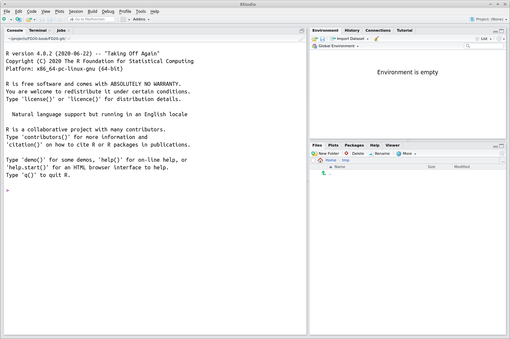
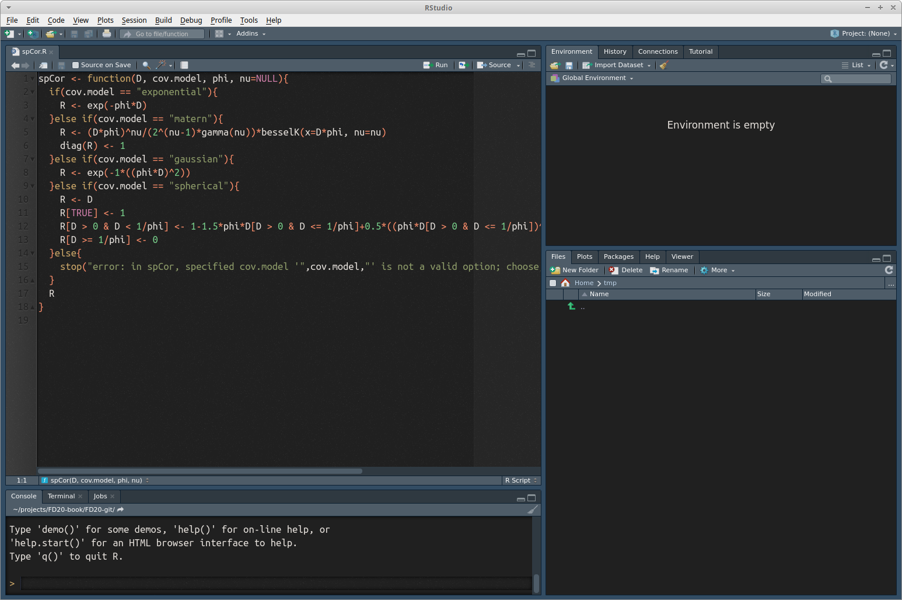

# Introduction to R and RStudio

Various statistical and programming software environments are used in data science, including R, Python, SAS, C++, SPSS, and many others. Each has strengths and weaknesses, and often two or more are used in a single project. This book focuses on R for several reasons:

1. R is free
2. It is one of, if not the, most widely used software environments in data science
3. R is under constant and open development by a diverse and expert core group
4. It has an incredible variety of contributed packages
5. A new user can (relatively) quickly gain enough skills to obtain, manage, and analyze data in R

Several enhanced interfaces for R have been developed. Generally such interfaces are referred to as *integrated development environments (IDE)*. These interfaces are used to facilitate software development. At minimum, an IDE typically consists of a source code editor and build automation tools. We will use the RStudio IDE, which according to its developers "is a powerful productive user interface for R."^[http://www.rstudio.com/] RStudio is widely used, it is used increasingly in the R community, and it makes learning to use R a bit simpler. Although we will use RStudio, most of what is presented in this book can be accomplished in R (without an added interface) with few or no changes. 

## Obtaining and installing R

It is simple to install R on computers running Microsoft Windows, macOS, or Linux. For other operating systems users can compile the source code directly.^[Windows, macOS, and Linux users also can compile the source code directly, but for most it is a better idea to install R from already compiled binary distributions.]
Here is a step-by-step guide to installing R for Microsoft Windows.^[New versions of R are released regularly, so the version number in Step 6 might be different from what is listed below.] macOS and Linux users would follow similar steps.

1. Go to http://www.r-project.org/
2. Click on the `CRAN` link on the left side of the page
3. Choose one of the mirrors.^[As the name implies, all *mirrors* provide the exact same software. The https://cloud.r-project.org/ mirror is usually fast; otherwise choose a mirror close to your geographic location.]
4. Click on `Download R for Windows`
5. Click on `base`
6. Click on `Download R 4.2.1 for Windows`
7. Install R as you would install any other Windows program


## Obtaining and installing RStudio

You must install R prior to installing RStudio. RStudio is also simple to install:

1. Go to http://www.rstudio.com
2. Click on the link `RStudio` under the `Products` tab
3. Click on the `RStudio Desktop` box
4. Choose the `DOWNLOAD RSTUDIO DESKTOP` link in the `Open Source Edition` column
5. On the ensuing page, click on the `Installer` version for your operating system, and once downloaded, install as you would any other program

## Using R and RStudio

Start RStudio as you would any other program in your operating system. For example, under Microsoft Windows use the Start Menu or double click on the shortcut on the desktop (if a shortcut was created in the installation process). A (rather small) view of RStudio is displayed in Figure \@ref(fig:rstudioPic).

```{r rstudioPic, fig.cap = "The RStudio IDE", out.width = "100%", echo = FALSE}

```

Initially the RStudio window contains three smaller windows. For now our main focus is on the large window on the left. This is the `Console` window and it is where you type R statements. The next few sections provide examples of using R statements focusing on small non-complex data sets. Later in the book we'll work with larger and more complex data sets. Read these sections at your computer with R running, and enter the R commands to become more comfortable using the R console window and RStudio.

### Rstudio themes

Figure \@ref(fig:rstudioPic) shows the default Rstudio theme and layout. RStudio provides great flexibility in changing themes and code highlighting to customize the RStudio interface. To switch between themes, click on the `Tools` bar at the top of the window, click on the `Global Options` tab, and then click on the `Appearance` tab where you will see the option to switch between three RStudio themes: Modern, Classic, and Sky.

You can also switch the Editor font and specify the Editor theme from a suite of options. We generally find that Editor themes with a dark background and mellow colored syntax highlighting is easier on the eyes. For example, an RStudio window using the Modern theme and the Ambiance Editor theme is shown in Figure \@ref(fig:rstudioDark). Note we included example code to illustrate syntax highlighting. Using a dark palette in RStudio is especially useful during long work sessions. If you're interested in specializing your Rstudio window even further, you can create custom editor themes (see [this Rstudio blog](https://support.rstudio.com/hc/en-us/articles/115011846747-Using-RStudio-Themes) for a useful tutorial).  

```{r rstudioDark, fig.cap = "The RStudio IDE using the Modern theme and the Ambiance Editor theme", out.width = "100%", echo = FALSE}

```

## Installing and calling R packages {#packages}

R, as with other programming languages, uses *functions* for performing different tasks. In R, functions are stored and shared in units referred to as *packages*. When R is installed, you can access bundled packages (e.g., `base`, `graphics`) that provide access to a suite of functions capable of performing a range of tasks. Whenever you open R, these packages automatically load and you can immediately start to use the functions they contain. 

While functions in the base installation of R (often referred to as base R) are useful, we'll often use packages written by other R community members, which contain functions specialized to our needs. To gain access to functions stored in packages not included in base R, you need to do two things:

1. Install the package. This is only done the first time you need to use the package.
2. Load the package. This is done every time you open a new RStudio session and need the package.

As an example, the code below installs then loads the `lubridate` package. This package provides many nifty functions for working with date-time data in R.  

```{r, eval = FALSE}
install.packages("lubridate") # Only do this once!
library(lubridate) 
```

The `install.packages` function installs the R package onto your computer, which may take some time depending on the package size. Notice that `lubridate` is inside quotation marks during installation, but not in quotations when loading the package. Once the package is loaded using the `library` function, you have access to all functions in the package. If you load a package, close R Studio, and then open a new RStudio window, you will not need to install the package again, but you will need to tell R to load the package using the `library` function.

## R as a calculator {#RCalculator}

R works as a calculator. The command prompt in R is the greater than sign `>` and is located in the lower left Console window in Figure \@ref(fig:rstudioPic). Code added after the command prompt is evaluated by pressing the Enter key. Below, and throughout the book, R code appears in a gray block following a command prompt and the output (i.e., result) follows without a command prompt. The `#` appearing in the code blocks below is the R comment character. R ignores everything following this character. We often briefly explain each line of code following the comment. Below you will see that R prints `[1]` before the output^[Also note the `##` before the output. This further distinguishes the code block from the resulting output, and makes it easier to copy and paste large portions of code, as R will register the copied output lines as comments.]. Following are a few examples of R commands followed by their output.

```{r}
34+20*sqrt(100)  # +,-,*,/ have the expected meanings
exp(2)  #The exponential function
log10(100)  #Base 10 logarithm
log(100)  #Base e logarithm
10^log10(55)
```

### Initial look at vectors and data {#RDescriptive}

It's easy to compute basic descriptive statistics and to produce standard graphical representations of data. For illustration, we create three variables with horsepower, miles per gallon, and names for 15 cars.^[These are from a relatively old data set, with 1974 model cars.] In this case with a small data set we enter the data "by hand" using the `c` function, which concatenates its arguments into a vector^[We'll provide a much more detailed introduction to vectors in Section \@ref(vector). We briefly mention them here as a bit of a teaser and to motivate some initial exploration of R's behavior.]. For larger data sets we will clearly want an alternative. 

As an aside on style, R has two widely used methods of assignment: the left arrow, which consists of a less than sign followed immediately by a dash, `<-`, and the equals sign, `=`. Much ink has been used debating the relative merits of the two methods, and their subtle differences. Many leading R style guides (e.g., the Google style guide at https://google.github.io/styleguide/Rguide.xml and the Bioconductor style guide at www.bioconductor.org/developers/how-to/coding-style) recommend the left arrow `<-` as an assignment operator, and we'll use this throughout the book.

Note if a command has not been completed but the Enter key is pressed, the command prompt changes to a `+` sign. To get back to the regular prompt sign, you can either type something to finish the command (i.e., `)` or `]`), or you can press the Esc key and retype the command.


```{r, tidy=FALSE}
car.hp <- c(110, 110, 93, 110, 175, 105, 245, 62, 95, 123, 
	    123, 180, 180, 180, 205)
car.mpg <- c(21.0, 21.0, 22.8, 21.4, 18.7, 18.1, 14.3, 24.4, 
	     22.8, 19.2, 17.8, 16.4, 17.3, 15.2, 10.4)
car.name <- c("Mazda RX4", "Mazda RX4 Wag", "Datsun 710", 
              "Hornet 4 Drive", "Hornet Sportabout", "Valiant", 
              "Duster 360", "Merc 240D", "Merc 230", "Merc 280", 
              "Merc 280C", "Merc 450SE", "Merc 450SL", 
              "Merc 450SLC", "Cadillac Fleetwood")
car.hp
car.mpg
car.name
```

Below we compute some descriptive statistics for the two numeric variables (`car.hp` and `car.mpg`)

```{r}
mean(car.hp)
sd(car.hp)
summary(car.hp)
mean(car.mpg)
sd(car.mpg)
summary(car.mpg)
```

Next, here's a very basic scatter plot of `cars.mpg` versus `cars.hp`. We'll take a much more detailed tour of R's graphics capabilities later.

```{r, fig.align = 'center'}
plot(car.hp, car.mpg)
```

Unsurprisingly as horsepower increases, mpg tends to decrease. This relationship can be investigated further using linear regression, a statistical procedure that involves fitting a linear model to a data set in order to further understand the relationship between two variables.

### An Initial Tour of RStudio

When you created the `car.hp` and other vectors in the previous section, you might have noticed the vector name and a short description of its attributes appear in the top right `Global Environment` window. Similarly, when you called `plot(car.hp,car.mpg)` the corresponding plot appeared in the lower right `Plots` window.  

### Practice Problem {#introRPractice}

**Practice Problem 2.1**: When running a large program consisting of numerous lines of complicated code, it is often basic algebraic typos that lead to the most frustrating bugs. Having a good grip on the order of operations is a basic, yet very important skill for writing good code. To practice, compute the following operation in R.

$$
\frac{(e^{14} + \text{log}_{10}(8)) \times \sqrt{5}}{\text{log}_{e}(4) - 5 * 10^2}
$$

```{r, include = FALSE}
# Answer
a <- (exp(14) + log10(8)) * sqrt(5)
b <- log(4) - (5 * 10^2)
a / b
```

## Workspace, working directory, and keeping organized {#workingDirectory}

The *workspace* is your R session work environment and includes any objects you create. Recall these objects are listed in the `Global Environment` window. The command `ls`, which stands for list, will also list all the objects in your workspace (note, this is the same list given in the `Global Environment` window). When you close RStudio, a dialog box will ask you if you want to save an image of the current workspace. If you choose to save your workspace, RStudio saves your session objects and information in a `.RData` file (the period makes it a hidden file) in your *working directory*. Next time you start R or RStudio it checks if there is a `.RData` in the working directory, loads it if it exists, and your session continues where you left off. Otherwise R starts with an empty workspace. This leads to the next question---what is a working directory?

Each R session is associated with a working directory. This is just a directory from which R reads and writes files, e.g., the `.RData` file, data files you want to analyze, or files you want to save. On Mac when you start RStudio it sets the working directory to your home directory (for me that's `/Users/andy`). If you're on a different operating system, you can check where the default working directory is by typing `getwd` in the console. You can change the default working directory under RStudio's `Global Option` dialog found under the `Tools` dropdown menu. There are multiple ways to change the working directory once an R session is started in RStudio. One method is to click on the `Files` tab in the lower right window and then click the `More` button. Alternatively, you can set the session's working directory using the `setwd` in the console. For example, on Windows `setwd("C:/Users/andy/book/exercise1")` will set the working directory to `C:/Users/andy/book/exercise1`, assuming that file path and directory exist (Note: Windows file path uses a backslash, `\`, but in R the backslash is an escape character, hence specifying file paths in R on Windows uses the forward slash, i.e., `/`). Similarly on Mac you can use `setwd("/Users/andy/book/exercise1")`. Perhaps the simplest method is to click on the `Session` tab at the top of your screen and click on the `Set Working Directory` option. Later on when we start reading and writing data from our R session, it will be very important that you are able to identify your current working directory and change it if needed. We'll revisit this in subsequent chapters.

As with all work, keeping organized is the key to efficiency. It's good practice to have a dedicated directory for each R project or exercise.

## Getting Help

A comprehensive, but overwhelming, cheatsheet for RStudio is available starting at the `Help` dropdown menu in RStudio `Help > Cheatsheets > R Markdown Cheat Sheet > RStuio IDE Cheat Sheet`. As we progress in learning R and RStudio, this cheatsheet will become more useful. For now you might use the cheatsheet to locate the various windows and functions identified in the coming chapters 

Several help-related functions are built into R. If there's a particular R function of interest, such as `log`, `help(log)` or `?log` will bring up a help page for that function. In RStudio the help page is displayed, by default, in the `Help` tab in the lower right window.^[There are ways to change this default behavior.] The function `help.start` opens a window which allows browsing of the online documentation included with R. To use this, type `help.start()` in the console window.^[You may wonder about the parentheses after `help.start`. A user can specify arguments to any R function inside parentheses. For example `log(10)` asks R to return the logarithm of the argument 10. Even if no arguments are needed, R requires empty parentheses at the end of any function name. In fact if you just type the function name without parentheses, R returns the definition of the function. For simple functions this can be illuminating.] The `help.start` function also provides several online manuals and can be a useful interface in addition to the built in help.

Search engines provide another, sometimes more user-friendly, way to receive answers for R questions. A Google search often quickly finds something written by another user who had the same (or a similar) question, or an online tutorial that touches on the question. When searching Google, solutions posted on platforms like [stack overflow](https://stackoverflow.com/) are often particularly useful. More specialized is [rseek.org](http://rseek.org), which is a search engine focused specifically on R. Both Google and rseek.org are valuable tools, often providing more user-friendly information than R's own help system.

In addition, R users have written many types of contributed documentation. Some of this documentation is available at http://cran.r-project.org/other-docs.html. Of course there are also numerous books covering general and specialized R topics available for purchase.

## Practice Problems {#practiceProblemsSectionIntroR}

For Practice Problems 2.2-2.5, perform the following simple calculations in the R console.

**Practice Problem 2.2**: Calculate 4 + $\sqrt{5}$.

```{r, include = FALSE}
4 + sqrt(5)
```

**Practice Problem 2.3**: Calculate $e^{10}$, where $e$ is the exponential function.

```{r, include = FALSE}
exp(10)
```

**Practice Problem 2.4**: Calculate $5^5 - 10^{10}$.

```{r, include = FALSE}
5^5 - 10^10
```

**Practice Problem 2.5**: Calculate $\frac{(5 + 5)}{(3 \times 4)}$. Make sure to include the parentheses in your code.

```{r, include = FALSE}
(5 + 5) / (3 * 4)
```

**Practice Problem 2.6**: Recall the plot we created of the `car.hp` values vs the `car.mpg` values using `plot(car.hp, car.mpg)`. Run the code to recreate this plot in the console. Next, run the code `plot(car.hp, car.mpg, pch = 19)`. What does the `pch = 19` argument do? Further explore the `pch` argument by setting `pch` to values different from 19, e.g., 15, 16, 3, etc.

```{r, include = FALSE, eval = FALSE}
plot(car.hp, car.mpg, pch = 19)
```

**Practice Problem 2.7**: Let's extend the plotting code a bit further. Run the code `plot(car.hp, car.mpg, pch = 19, col = 'blue')` in the console. What does the `col` argument do? Don't like blue? Choose a different color from the list of built-in colors displayed by typing `colors()` in the console.

```{r, include = FALSE, eval = FALSE}
plot(car.hp, car.mpg, pch = 19, col = 'blue')
```

**Practice Problem 2.8**: Run the code `plot(car.hp, car.mpg, pch = 19, col = 'blue', xlab = 'Horsepower')` in the console. What does the `xlab = 'Horsepower'` do? There is a similar argument called `ylab`. Try to figure out a way to change the label of the y-axis to `Miles per Gallon`.

```{r, include = FALSE, eval = FALSE}
plot(car.hp, car.mpg, pch = 19, col = 'blue', xlab = 'Horsepower', ylab = 'Miles per Gallon')
```

