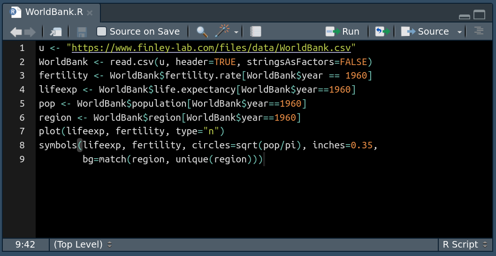
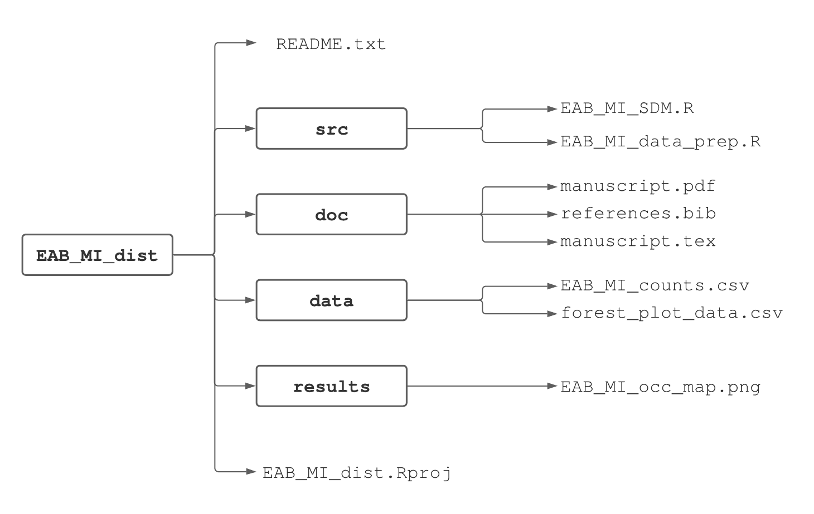

# Data import/export, scripts, and reproducible workflow {#scripts}

Data analysis, whether for a professional project or research, typically involves many steps and iterations. For example, creating a figure effective at communicating results can involve trying out several different graphical representations, and then tens if not hundreds of iterations to fine-tune the chosen representation. Each of these iterations might require several lines of R code to create. Although this all could be accomplished by typing and re-typing code lines at the R Console, it's easier and more efficient to write the code in a *script* that can then be submitted to the R console either a line at a time, several lines at a time, or all together.

In addition to making the workflow more efficient, R scripts provide another great benefit. Often we work on one part of an exercise or project for a few hours, then move on to something else, and then return to the original part a few days, months, or sometimes even years later. In such cases we might have forgotten how we created a particularly nice graphic or how to replicate an analysis, with the result being several hours or days of work to rewrite the necessary code. If we save a script file, we have the ingredients immediately available when we return to a portion of a project.^[In principle the R history mechanism provides a similar record. But with history we have to search through a lot of other code to find what we're looking for, and scripts are a much cleaner mechanism to record our work.]

Next consider a larger scientific endeavor. Ideally a scientific study will be reproducible, meaning that an independent group of researchers (or the original researchers) will be able to duplicate the study. Reproducible research means the steps taken in a study can be replicated, from importing external data sets and wrangling them into formats for data analysis, to creating tables and figures using the analysis results. In principle this entire process could be detailed in a step-by-step guide using words; however, in practice, it's typically difficult or impossible to reproduce a full data analysis based on a written explanation. It's much more effective to include the actual data sets and computer code that accomplished all the steps in the report, whether the report is an exercise or research paper. Tools in R such as scripts with commented annotation facilitate this process.

In this chapter, we will present a thorough introduction of R scripts and how they can be used to facilitiate the process of reproducible research. We will introduce essential functions for importing external data sets into R as well as for exporting data from R to an external file. While providing further motivation for the use of scripts, we will provide recommendations on how to write high quality and reproducible R code including best practices for file naming, variable naming, directory structures, and code formatting. While many of the recommendations may initially seem tedious and unnecessary, we speak from experience that by using scripts, staying organized, and using a reproducible workflow you will save yourself tremendous amounts of time and headaches in the long run.

## Data import {#import}

Data come in a dizzying variety of formats. It might be a proprietary format used by commercial software such as Excel, SPSS, or SAS. It might be structured using a relational model, for example, the USDA Forest Service Forest Inventory and Analysis database [@FIADB]. It might be a data-interchange format such as JSON (JavaScript Object Notation; @JSON16), or a markup language format such as XML (Extensible Markup Language; @XML2008) perhaps with specialized standards for describing ecological information such as EML (Ecological Metadata Language; @EML2019). The good news is we've yet to encounter a data format unreadable by R. This is thanks to the large community of R package developers and data formats specific to their respective disciplines. For example, the `foreign` and `haven` packages provide functions for reading and writing data in common proprietary statistical software formats. Similarly, as we'll see in Chapter \@ref(spatial), the `rgdal` and `raster` packages read and write pretty much any spatial data formats used in popular GIS software.

Fortunately many datasets are (or can be) saved as plain text files. Most software can read and write such files, so our initial focus is on reading and writing plain text files.

The function `read.table` and its offshoots, such as `read.csv`, are used to read 2-dimensional data, i.e., rows and columns, from a plain text file and are the core functions for reading external datasets into R. For example, the file `BrainAndBody.csv` contains data^[These data come from the `MASS` R library.] on the brain weight, body weight, and name of some terrestrial animals. Here are the first few lines of that file:

```
body,brain,name
1.35,8.1,Mountain beaver
465,423,Cow
36.33,119.5,Grey wolf
27.66,115,Goat
1.04,5.5,Guinea pig
```

As is evident, the first line of the file contains the names of the three variables, separated (delimited) by commas. Each subsequent line (row) contains the body weight, brain weight, and name of a specific terrestrial animal.

This file is accessible at the url https://www.finley-lab.com/files/data/BrainAndBody.csv. The `read.table` function is used to read these data into an R data frame. A data frame is a common rectangular (i.e., two-dimensional) data structure in R that consists of rows and columns. We will cover data frames extensively in Chapter \@ref(structures). 

```{r, tidy = FALSE}
link.bb <- "https://www.finley-lab.com/files/data/BrainAndBody.csv"
BrainBody <- read.table(file = link.bb, header = TRUE, sep = ",", 
                        stringsAsFactors = FALSE)
str(BrainBody)
head(BrainBody)
```

The `read.table` arguments and associated values used above include:

1. `file = link.bb` identifies the file location. In this case the string `https://www.finley-lab.com/files/data/BrainAndBody.csv` giving the location is rather long, so it was first assigned to the object `link.bb`.
2. `header = TRUE` specifies the column names are held in the file's first row, known as the "header".
3. `sep = ","` defines the comma as the character delimiter between the file's columns.
4. `stringsAsFactors = FALSE` tells R not to convert character vectors to factors. While we have yet to discuss the different types of vectors in R, prior to R 4.0.0 `stringsAsFactors=TRUE` was the default behavior, and so we will often explicitly include this argument in our call to `read.table` to avoid any differences across R versions. The new default value is `FALSE` so we could have chosen not to include this in the code). 

When we call `read.table` or `read.csv`, the resulting object is read into R and represented as a data frame. The `str` function and `head` are two useful functions for looking at the structure of a data frame (or any R object). The `str` function displays the structure of the object `BrainBody` that contains the data from the `BrainAndBody.csv` file. Notice the object is a data frame with `r nrow(BrainBody)` observations (i.e., rows) and `r ncol(BrainBody)` variables (i.e., columns). The column names are displayed following the `$`^[The use of the `$` will become clear in Chapter \@ref(structures).]. The `head` function displays the the first six rows and all columns of the data frame. An alternative way to view a data frame is to use the `View` function, which opens up a spreadsheet interface in R. Try this out by running `View(BrainBody)` in your console.

The function `read.csv` is the same as `read.table` except the default separator is a comma, whereas the default separator for `read.table` is whitespace.

The file `BrainAndBody.tsv` contains the same data, except a tab is used in place of a comma to separate fields. The only change needed to read in the data in this file is in the `sep` argument (and of course the `file` argument, since the data are stored in a different file):

```{r, tidy = FALSE}
file.bb <- "https://www.finley-lab.com/files/data/BrainAndBody.tsv"
BrainBody2 <- read.table(file = file.bb, header = TRUE, sep = "\t", 
                         stringsAsFactors = FALSE)
head(BrainBody2)
```

File extensions, e.g., `.csv` or `.tsv`, are naming conventions only and are there to remind us how the columns are separated. In other words, they have no influence on R's file read functions.

A third file, `BrainAndBody.txt`, contains the same data, but also contains a few lines of explanatory text above the names of the variables. It also uses whitespace rather than a comma or a tab as a separator. Here are the first several lines of the file.

```
This file contains data
on brain and body
weights of several terrestrial animals

"body" "brain" "name"
1.35 8.1 "Mountain beaver"
465 423 "Cow"
36.33 119.5 "Grey wolf"
27.66 115 "Goat"
1.04 5.5 "Guinea pig"
11700 50 "Dipliodocus"
2547 4603 "Asian elephant"
```

Notice that in this file the values of `name` are put inside of quotation marks. This is necessary since instead R would (reasonably) assume the first line contained the values of four variables, the values being `1.35`, `8.1`, `Mountain`, and `beaver` while in reality there are only three values desired, with `Mountain beaver` being the third.

To read in this file we need to tell R to skip the first five lines and to use whitespace as the separator. The `skip` argument handles the first, and the `sep` argument the second. First let's see what happens if we don't use the `skip` argument.

```{r, tidy = FALSE, error = TRUE}
file.bb <- "https://www.finley-lab.com/files/data/BrainAndBody.txt"
BrainBody3 <- read.table(file.bb, header = TRUE, sep = " ",
                         stringsAsFactors = FALSE)
```

R assumed the first line of the file contained the variable names, since `header = TRUE` was specified, and counted four including `This`, `file`, `contains`, and `data`. So in the first line of actual data, R expected four columns containing data plus possibly a fifth column containing row names for the data set, and complained that "line 1 did not have 5 elements." The error message is somewhat mysterious, since it starts with "Error in scan." This happens because `read.table` actually uses a more basic R function called `scan` to do the work.

Here's how to read in the file correctly.

```{r, tidy = FALSE}
file.bb <- "https://www.finley-lab.com/files/data/BrainAndBody.txt"
BrainBody3 <- read.table(file.bb, header = TRUE, sep = " ",
                         stringsAsFactors = FALSE, skip = 4)
head(BrainBody3)
```

## Importing data with missing observations

Missing data are represented in many ways. Sometimes a missing data point is just that, i.e., the place where it should be in the file is blank. Other times specific numbers such as $-9999$ or specific symbols are used. The `read.table()` function has an argument `na.string` that allows the user to specify how missing data is indicated in the source file.

The site http://www.wunderground.com/history/ makes weather data available for locations around the world from dates going back to 1945. The file `WeatherKLAN2014.csv` contains weather data for Lansing, Michigan for the year 2014. Here are the first few lines of that file:

```
EST,Max TemperatureF,Min TemperatureF, Events
1/1/14,14,9,Snow
1/2/14,13,-3,Snow
1/3/14,13,-11,Snow
1/4/14,31,13,Snow
1/5/14,29,16,Fog-Snow
1/6/14,16,-12,Fog-Snow
1/7/14,2,-13,Snow
1/8/14,17,-1,Snow
1/9/14,21,2,Snow
1/10/14,39,21,Fog-Rain-Snow
1/11/14,41,32,Fog-Rain
1/12/14,39,31,
```

Look at the last line, and notice that instead of an `Event` such as `Snow` or `Fog-Snow` there is nothing after the comma. This observation is missing, but rather than using an explicit code such as `NA`^[Recall `NA` stands for "Not Available".], the site just leaves that entry blank. To read these data into R we will supply the argument `na.string = ""` which tells R the file indicates missing data by leaving the appropriate entry blank. We then print a subset of the resulting data frame to make sure the offending missing values were replaced with `NA`. 

```{r, tidy = FALSE}
u.weather <- "https://www.finley-lab.com/files/data/WeatherKLAN2014.csv"
WeatherKLAN2014 <- read.csv(u.weather, header=TRUE,
                            stringsAsFactors = FALSE, na.string = "")
head(WeatherKLAN2014, n = 15)
```

Notice the use of the argument `n = 15` in the `head` function, which displays the first 15 rows of the `WeatherKLAN2014` data frame^[Look at the help page for `head`. The default value is `n = 6`.]. 

## Data export

Data stored in external text files are rarely in the format required for data analysis and summarization. We may need to create new variables in the data set, transform variables to different scales, rearrange the data, or manipulate the data to fix incorrect observations. The process of identifying and ultimating fixing incorrect observations from a data set is called *data cleaning*, while *data wrangling* is the process of obtaining and transforming data to answer a specific data analysis question. R has a vast suite of tools for data cleaning and data wrangling that we will cover extensively in Chapter \@ref(tidyverse). After cleaning and wrangling the data in R, we may want to create a new external text file that contains the data in the desired data analysis format for use in a separate project, submission to an agency, or archiving on a data repository. The R function `write.table` allows us to take a data set in R and save it as an external file.

To illustrate `write.table`, let's try to create a new csv file in our current working directory named `WeatherKLAN2014New.csv` from the `WeatherKLAN2014` object we previously created. We do this with the following code.

```{r, eval = FALSE}
write.table(x = WeatherKLAN2014, file = 'WeatherKLAN2014New.csv', sep = ',',
	    row.names = FALSE, na = 'NA')
```

Let's walk through each of the arguments and associated values used in the previous code chunk:

+ `x = WeatherKLAN2014` is the R object we want to write to an external file, in this case the `WeatherKLAN2014` data set.
+ `file = 'WeatherKLAN2014New.csv'` is the name of the file in which we want to store the data specified in argument `x`. The file will be created relative in our current working directory as this is the directory R uses for relative paths (Section \@ref(paths)).
+ `sep = ','` defines the comma as the character delimiter between the file's columns, just as we saw with `read.table`.
+ `row.names = FALSE` tells R not to create a column in the external data set that contains the row names of the associated R object `x`. This argument is by default `row.names = TRUE`. We do not recommend storing data in the row names of R objects, and so we usually set `row.names = FALSE`.
+ `na = NA` tells R to use the value `NA` to represent missing data in the resulting text file.

Similar changes can be made to `write.table` to create tab-separated files, plain text files, or other simple text files by changing the `sep` argument and the file extension in the `file` argument.

## Scripts in R

Scripts help to make working with data more efficient and provide a record of how data are managed and analyzed. Below we describe an example. This example uses features of R that we have not yet discussed, so don't worry about the details, but rather about how it motivates the use of a script file. 

First we read in a data set containing data on (among other things) fertility rate and life expectancy for countries throughout the world, for the years 1960 through 2014. 

```{r}
u <- "https://www.finley-lab.com/files/data/WorldBank.csv"
WorldBank <- read.csv(u, header=TRUE, stringsAsFactors=FALSE)
```

Next we print the names of the variables in the data set. Don't be concerned about the specific details. 

```{r}
names(WorldBank)
```

We will try to create a scatter plot of fertility rate versus life expectancy of countries for the year 1960. To do this we'll first create variables containing the values of fertility rate and life expectancy for 1960^[This isn't necessary, but it is convenient], and print out the first ten values of each variable.

```{r}
fertility <- WorldBank$fertility.rate[WorldBank$year == 1960]
lifeexp <- WorldBank$life.expectancy[WorldBank$year==1960]
fertility[1:10]
lifeexp[1:10]
```

We see that some countries do not have data for 1960. R represents missing data via `NA`. Of course at some point it would be good to investigate which countries' data are missing and why. The `plot` function in R will just omit missing values, and for now we will just plot the non-missing data. A scatter plot of the data is drawn next.

```{r}
plot(lifeexp, fertility)
```

The scatter plot shows that as life expectancy increases, fertility rate tends to decrease in what appears to be a nonlinear relationship. Now that we have a basic scatter plot, it is tempting to make it more informative. We will do this by adding two features. One is to make the points' size proportional to the country's population, and the second is to make the points' color represent the region of the world the country resides in. We'll first extract the population and region variables for 1960.

```{r}
pop <- WorldBank$population[WorldBank$year==1960]
region <- WorldBank$region[WorldBank$year==1960]
pop[1:10]
region[1:10]
```

To create the scatter plot we will do two things.  First we will create the axes, labels, etc. for the plot, but not plot the points. The argument `type="n"` tells R to do this. Then we will use the `symbols` function to add symbols, the `circles` argument to set the sizes of the points, and the `bg` argument to set the colors. Don't worry about the details! In fact, later in the book we will learn about an R package called
 `ggplot2` that provides a different way to create such plots. You'll see two plots below, first the "empty" plot which is just a building block, then the plot including the appropriate symbols.
 
```{r, tidy = FALSE}
plot(lifeexp, fertility, type="n")
symbols(lifeexp, fertility, circles=sqrt(pop/pi), inches=0.35, 
        bg=match(region, unique(region)))
```

Of course we should have a key which tells the viewer which region each color represents, and a way to determine which country each point represents, and a lot of other refinements. For now we will resist such temptations. 

Some of the process leading to the completed plot is shown above, such as reading in the data, creating variables representing the 1960 fertility rate and life expectancy, an intermediate plot that was rejected, and so on. A lot of the process isn't shown, simply to save space. There would likely be mistakes (either minor typing mistakes or more complex errors). Focusing only on the `symbols` function that was used to add the colorful symbols to the scatter plot, there would likely have been a substantial number of attempts with different values of the `circles`, `inches`, and `bg` arguments before settling on the actual form used to create the plot. This is the typical process you will soon discover when producing useful data visualizations. 

Now imagine trying to recreate the plot a few days later. Possibly someone saw the plot and commented that it would be interesting to see some similar plots, but for years in the 1970s when there were major famines in different countries of the world. If all the work, including all the false starts and refinements, were done at the console, it would be hard to sort things out and would take longer than necessary to create the new plots. This would be especially true if a few months had passed rather than just a few days.

Creating the new scatter plots would be much easier with a script file, especially if it had a few well-chosen comments. Fortunately it's easy to create and work with script files in RStudio. Just choose `File > New File > New script` and a script window will open up in the upper left of the full RStudio window. A script is simply a text file that contains R code and ends with the file suffix `.R`. Efficient use of R scripts is a key step towards creating a reproducible and organized workflow. 

An example of a script window (with some R code already typed in) is shown in Figure \@ref(fig:script). From the script window the user can, among other things, save the script (either using the `File` menu or the icon near the top left of the window) and run one or more lines of code from the window (using the `run` icon in the window, or by copying and pasting into the console window). In addition, there is a `Source on Save` checkbox. If this is checked, the R code in the script window is automatically read into R and executed when the script file is saved.

```{r script, out.width = '100%', fig.cap = "A script window in RStudio.", echo = FALSE}

```
## Quality of R code

Although a bit harsh, Figure \@ref(fig:comic) points out that following code style guides, staying consistent with your chosen file and variable naming, and using ample comments will make your code accessible and reusable to you and others. The scripts you write for this book's examples and exercises form your codebase for future projects. A *codebase* is simply the collection of code used in analysis or software development. As your codebase grows, coding tasks become easier because you reuse code snippets and functions written for various previous tasks.

```{r comic, echo = FALSE, out.width = "100%", fig.cap = "xkcd.com's take on code quality."}
knitr::include_graphics("figures/code_quality.png")
```

Google provides style guides for many programming languages. You can find the R style guide at [https://google.github.io/styleguide/Rguide.html](https://google.github.io/styleguide/Rguide.html). In subsequent sections, we detail a few key points from the guide along with some others for maintaining high-quality R code.

## Best practices for naming and formatting

You can do your future self a favor and use clear and consistent naming conventions (or rules) for files, variables, and functions. There have been more times than we like to admit when we find ourselves sifting through old directories trying to find a script that has code we could reuse for the task at hand. Or we spend too much time reading through a script that we or someone else wrote, trying to figure out what poorly named variables represent in the analysis. Using an acceptable naming convention is key to reducing confusion and saving time. 

### Script file naming

Script file names should be meaningful and end with a ".R" extension. They should also follow some basic naming conventions. For example, say we're conducting an analysis on the emerald ash borer (EAB)^[https://en.wikipedia.org/wiki/Emerald_ash_borer.] distribution in Michigan and save the code in a script. Consider these possible script file names:

+ `r colorize("GOOD", "ForestGreen")`: `EAB_MI_dist.R` (naming convention called delimiter naming using an underscore)
+ `r colorize("GOOD", "ForestGreen")`: `emeraldAshBorerMIDist.R` (naming convention called *camelCase*^[https://en.wikipedia.org/wiki/Camel_case])
+ `r colorize("BAD", "RedOrange")`: `insectDist.R` (too ambiguous)
+ `r colorize("BAD", "RedOrange")`: `insect.dist.R` (too ambiguous and two periods can confuse operating systems' file type auto-detect)
+ `r colorize("BAD", "RedOrange")`: `emeraldashborermidist.R` (too ambiguous and confusing)

### Variable naming

Similar to script file names, there is value in following a convention for naming variables used in your R scripts. Here are some examples of good and bad choices for a fictitious variable that holds EAB counts used in the EAB analysis script:

- `r colorize("GOOD", "ForestGreen")`: `eab_count` (we don't mind the underscore delimiter naming and use it quite often, although Google's style guide says it's a no-no for some reason)
- `r colorize("GOOD", "ForestGreen")`: `eab.count` (delimiter naming using a period)
- `r colorize("GOOD", "ForestGreen")`: `EABCount` (*camelCase* naming again)
- `r colorize("BAD", "RedOrange")`: `eabcount` (confusing)

### Code formatting

Here are some other coding best practices that help readability:

- Keep code lines under 80 characters long.
- Allow some whitespace in a consistent way between code elements within lines. Include one space on either side of mathematical and logical operators. No space on either side of `:`, `::`, and `:::` operators, which we'll encounter later. Like the English language, always add a space after a comma and never before. Add a space before and after parentheses in an expression. Parentheses and square brackets can be directly adjacent to whatever they're enclosing (unless the last character they enclose is a comma). There should be no space between a function name and left parentheses that opens the function's arguments. Notice how the use of whitespace rules below makes reading the code easier on the eyes:
  - `r colorize("GOOD", "ForestGreen")`: `d <- a + (b * sqrt(5 ^ 2)) / e[1:5, ]`
  - `r colorize("BAD", "RedOrange")`: `d<-a+(b*sqrt ( 5^2 ))/e[ 1 : 5 ,]`
- Avoid unnecessary parentheses; rather, rely on order of operations:
  - `r colorize("GOOD", "ForestGreen")`: `(a + 4) / sqrt(a * b)`
  - `r colorize("BAD", "RedOrange")`: `((a) + (4)) / (sqrt((a) * (b)))`
- Indent code two spaces within functions, loops, and decision control structures (RStudio does this by default when you press the TAB key), we'll revisit this point in Chapter \@ref(functions) where these topics are introduced.
- Consolidate calls to packages (using the `library` function) at the top of the R script rather than interspersing them throughout the script. We'll demonstrate this later when working with packages not included in base R (Section \@ref(packages)).


## Relative and absolute paths {#paths}

In Section \@ref(workingDirectory), we introduced the concept of a working directory. A working directory is the directory associated with each R session from which R reads and writes files. Your current working directory is shown at the top of the console window (e.g., see bottom of Figure \@ref(fig:rstudioPic)). You can change the working directory using methods discussed in Section \@ref(workingDirectory), such as the `setwd` function. 

Consider the following example where we set our working directory to the directory containing all materials for the course and subsequently read in a data set from the Fernow Experimental Forest (FEF) of the United States Forest Service (USFS) containing information on tree form and structure.

```{r, eval = FALSE}
setwd('/Users/andy/FOR-875/')
fef.trees <- read.table(file = "data/FEF_trees.csv",
                        header = TRUE, sep = ",")
```

When we read in the FEF data set, we list the file path as `data/FEF_trees.csv`. A *path* is the location where some file is located on your computer. There are two types of paths, known as absolute and relative paths. An *absolute path* is the complete path to a file. In other words, an absolute path will lead to the same final destination regardless of your working directory. A *relative path* gives the path to a location *relative* to the current working directory. In R, when you use a relative path to locate a file, R will look for it in the working directory. In our example, the file path `data/FEF_trees.csv` is a relative path, because we have not given the complete path of the file. The path is relative to the current working directory, which was set to `/Users/andy/FOR-875/`. Given that the working directory is properly set, R will locate the `datasets` folder inside `/Users/andy/FOR-875/`, and then will look for a file called `FEF_trees.csv`. 

Alternatively, we could have used an absolute path in our call to `read.table` so that the `file` argument was `/Users/andy/FOR-875/data/FEF_trees.csv`. While it may seem attractive to work with absolute paths as you don't need to worry about setting the working directory, we **do not recommend** the use of absolute paths in your R code. Every directory structure on a computer is different, so the absolute path to a file on your computer will be different to the absolute path of a file on any other computer. This makes sharing code and developing reproducible research extremely difficult, especially when considering differences in directory structuring across operating systems. The use of relative paths will greatly facilitate sharing your code with others, which is why we always recommend using relative paths. Further, the use of RStudio Projects can make working with relative paths even more simple.

## RStudio Projects {#projects}

It may see cumbersome to keep track of the current working directory to ensure you are reading and writing files in the correct directory. One way to make this a bit easier is to set the working directory at the top of each R script you write using `setwd` as opposed to using the buttons provided in RStudio (Section \@ref(workingDirectory)). When working on a project, it is best to keep all parts of the project in an organized directory structure (Section \@ref(directories)). For an entire project you will likely use `setwd` to set the working directory to a common directory across all phases of a project. Because of this common task, RStudio has created what they call *projects* to help maintain organization and eliminate the constant use of `setwd`. 

To create an RStudio project, click on the `File` bar at the top of the RStudio window followed by `New Project`. This will open up a menu with three options: New Directory, Existing Directory, or Version Control. Click on `New Directory` to start an R project in a new directory. The next window will ask you to specify the `Project Type`, where you should choose `Empty Project`. The final window titled `Create New Project` will ask you to give a name to the directory and a location to place the directory. We encourage you to create a new project for this course titled `FOR-875` in a location of your choice. Once you have specified the directory name and location of the new directory, click `Create Project`. In the top right corner of your RStudio screen, you should now see your project name (`FOR-875`) that indicates you are currently working on that project. Clicking on that tab should reveal a menu that allows you to switch between different projects, create a project, and control the default behavior of projects. 

The primary benefit of an Rstudio Project is that each project is automatically associated with it's own working directory. In other words, whenever you open an RStudio project, the working directory is immediately set to the directory where the project is located. If you look at the top of the console window after creating the `FOR-875` project, you should see the absolute path of your current working directory, which is the `FOR-875` project location. Each project is also associated with its own history, which can be useful if you ever forget to save some important code in a script. By automatically setting the working directory and maintaining a history of all code written in the project, projects allow for better organization, less troubleshooting errors with specifying incorrect working directories, and improved reproducibility. 

## Directory structure {#directories}

While the use of RStudio projects alone provides many practical benefits, maintaining an organized and clear directory structure within each project is crucial for organization and efficiency. A clear directory structure becomes even more important when a project involves multiple people or when the project may potentially be used by others after posting it on a public repository. There is no single way to structure directories. As you learn R and become more familiar with the procedures involved in data analysis, you will learn how you like to name your directories, how many different sub-directories you have, and how this can vary depending on the purpose of the project. Despite the high specifictiy for structuring directories, we will suggest a single, hierarchical structuring approach that is commonly used in computational biology, among other fields [@sandve2013ten, @wilson2017good]. Figure \@ref(fig:directoryEx) shows an example project using our suggested directory structure for a project modeling the distribution of the invasive Emerald Ash Borer (EAB) in Michigan.  

```{r directoryEx, echo = FALSE, out.width = "100%", fig.cap = "An example project using a hierarchical directory structure."}

```

In the main project directory we suggest having two files and four sub-directories. The first file is the RStudio project file itself, which has an extension of `.Rproj`. The second file is called a README file, which provides basic metadata in the form of a simple text file (`.txt`) on the purpose of the overall project, the contencts of the project and each sub-directory, and a short description on the purpose of each file. We strongly suggest starting each project with a README.txt file and adding information to the file as the project progresses^[The README file could also be a markdown (.md) file. See Chapter \@ref(reports).]. This process will not only help you keep track of where you store different files, but it is crucial for effective collaboration and sharing of your research. 

The four sub-directories are called `data`, `results`, `doc`, and `src`. The `data` directory should contain raw data and metadata used in the analysis. Depending on how much data you are working with you may have multiple sub-directories within the `data` directory. In Figure \@ref(fig:directoryEx), the data directory consists of two files, one containing counts of EAB across Michigan (`EAB_MI_counts.csv`) and a second containing data from forest plots (`forest_plot_data.csv`) that we ultimately seek to relate to the EAB distribution. The `results` directory should contain any files generated during the analysis, such as cleaned and tidy data sets (Section \@ref(tidyr), as well as finished products such as figures (Chapter \@ref(ggplot2)) and tables (Section \@ref(kables)). For large projects, it is useful to have a separate sub-directory inside the `results` directory called `figures` where final figures are stored. The `doc` directory contains any sort of text document associated with the project. Depending on the purpose of the project this can include files for manuscripts, notes, lectures, or professional reports). In Figure \@ref(fig:directoryEx), the `doc` directory consists of three files used to write a manuscript in LaTeX. Again, subdirectories may be neccessary depending upon the size of the project. Lastly, the `src` directory (short for "source code") contains all code written for the project^[The second author prefers to name this directory `code`. Another common alternative is `analysis`.]. As we suggest throughout this chapter, your code will primarily be in the form of R scripts. 

Employing this hierarchical directory structure, along with proper documentation in the `README` file, will create an organized directory structure that will improve your efficiency as you work on a project and will make your work more accessible to collaborators, or your future self if you revisit a project a few months or years later. By employing the use of RStudio projects, you can easily use relative paths when reading or writing files in R. For example, to read the file `EAB_MI_counts.csv` for use in the `EAB_MI_data_prep.R` script, we will load our RStudio project (which will automatically set the working directory to `EAB_MI_dist`), and specify our relative path as `data/oak-regen.csv` in a call to `read.csv`. 

While we have presented a specific hierarchical structure for data analysis projects using R, we again emphasize that the specific directory names are not as important as ensuring a systematic and intuitive approach for organizing large projects. Your organization structure will likely be constantly adapting as you learn more about what works and what doesn't.

## Exercises {#exCh3}

**Exercise 1** Learning objectives: set up an RStudio Project and a hierarchical directory structure for the course; explore the workspace within RStudio and associated commands; produce basic descriptive statistics and graphics; practice reading in different types of data sets.

